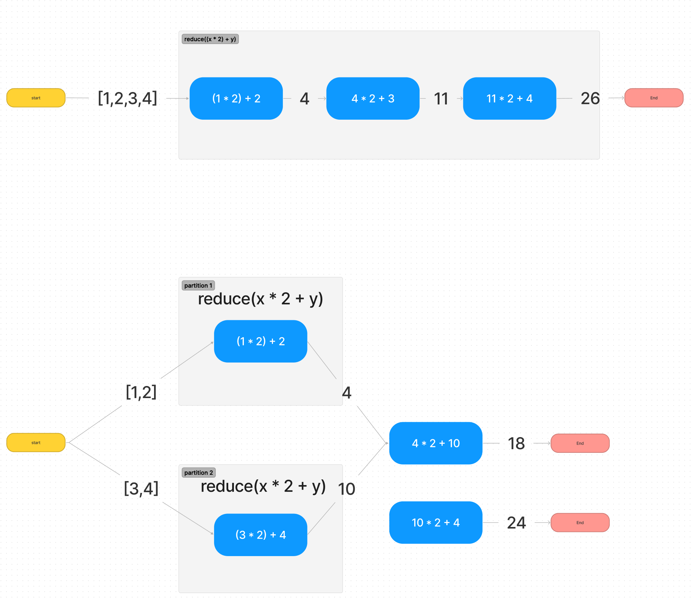

# 2-1 병렬처리와 분산처리

# 1. 병렬처리와 분산처리 및 latency

스파크는 분산 환경에서 병렬 처리로 동작하기 때문에
작성하는 코드가 클러스터에서 어떻게 동작할지 이해하고 코딩을 작성해야 한다.

ex) `reduceByKey`는 각 클러스터 연산을 합치는 동작을 하기 때문에 `클러스터 네트워크 통신`을 한다.

1. RDD.map(A)`.reduceByKey(C)`.filter(B)
2. RDD.map(A).filter(B)`.reduceByKey(C)`

# 3. key-value RDD

함수의 반환 값이 여러 개인 경우 key-value RDD가 된다.

ex)

```python
# python
pairs = rdd.map(lambda x: (x, 1))
```

key value RDD

- 넷플릭스 드라마가 받은 평균 별점(날짜, 승객 수)
- 지역 id 별로 택시 `운행 수`
    - key: 지역 ID
    - value: 운행 수
- 드라마 별로 `별점 수` 모아보기, `평균` 구하기
    - key: 드라마 id
    - value: 별점 수
    - value: 평균
- 이커머스 사이트에서 상품당 `별 평점` 구하기

single value RDD

- 텍스트에 등장하는 단어 수 세기 (날짜)

## reduction function

    `key`가 변경되지 않는 경우 ~~.map()~~ -> `mapValues()` 활용.
    spark 내부적으로 파티션을 유지하여 효율이 증가

    `mapValues()`
    `flatMapValues()`

- reduceByKey()
    - key 값을 기준으로 accumulate 함
- groupByKey()
    - key 값을 기준으로 값을 그룹화
- sortByKey()
    - 키 값을 기준으로 정렬
- keys()
    - 키 추출
- values()
    - 값 추출
- db와 같은 기능
    - join()
    - rightOuterJoin()
    - leftOuterJoin()
    - subtractByKey()

## 실습

[restaurant_reviews](../../src/main/scala/_01/CategoryReviewAverage.py)

# 4. transformations and actions

Spark operation = transformations + actions의 연산

`transformation`

- `지연 실행`: lazy execution
- 중단 연산
- 새로운 RDD 객체 반환

`actions`

- `즉시 실행`: eager execution
- 종단 연산
- list, map과 같은 자료형으로 변환

## transformations functions

- map
- flatMap
- filter
- distinct
- reduceByKey
- groupByKey
- mapValues
- flatMapValues
- sortByKey
- ...

## Actions

- collect
- count
- countByValue
- take
- top
- reduce
- fold
- foreach
- ...

  foreach는 worker 노드에서만 동작하기 때문에
  master node console에서 실행해도 눈으로 볼 수 없음

  (pycharm은 볼 수 있었음.)

## Narrow transformation

1:1 변환

1개의 열을 조작하기 위해 다른 열이나 파티션의 데이터를 사용할 필요가 없다. `(다른 데이터가 들어가지 않는다.)`

정렬이 필요하지 않은 경우 사용

비교가 발생하면 클러스터간 통신이 일어남

- filter
- map
- flatMap
- sample
- union
- ...

## Wide Transformation

최종 반환되는 RDD 파티션에 다른 파티션 데이터가 `들어갈 수 있음`

**많은 리소스와 통신을 필요로 한다.**

- shuffling
- intersection
- join
- distinct
- cartesian
- reduceByKey
- groupByKey

### 실습

[rdd_transformations_actions](../../src/main/scala/_01/rdd_transformation_actions.ipynb)

# 5. Cache & Persist

## Storage level

메모리 어디까지 저장할 것인지?

1. MEMORY_ONLY
    1. 메모리에만
2. MEMORY_AND_DISK
    1. 메모리와 디스크 동시에 저장.
    2. 메모리에 없으면 디스크를 확인
3. MEMORY_ONLY_SER
    1. serializa 약자
    2. 구조화를 하기에 메모리를 아낄 수 있지만, ser/des 작업이 추가됨
4. MEMORY_AND_DISK_SER
    1. 직렬화/역직렬화
    2. 메모리
    3. 디스크
5. DISK_ONLY
    1. 디스크에만

## Cache

- 디폴트 storage level 사용
- RDD: MEMORY_ONLY
- DF: MEMORY_AND_DISK

## Persist

- Storage level을 사용자가 원하는 대로 지정 가능

# 6. Cluster Topology

스파크 클러스터의 내부 구성

- master
- worker


스파크의 데이터는 분산되어 있다.

같은 연산도 여러 노드에 걸쳐서 실행됨.

[도식화](https://www.figma.com/file/FRoBoT4w7mqIiK3UuM7SKV/Spark-Context-Manager-Worker?node-id=0%3A1&t=SRZzKZ0BLCE64VjV-1)


# 7. Reduction operations

## Parallel transformations

action이 분산된 환경에서 작동하는 방법
- 각 파티션은 서로의 파티션 결과에 의존하지 않고 독립적이어야 함.


    파티션이 어떻게 나뉘는지 알 수 없기 때문에
    `교환법칙`, `결합법칙`이 성립하는 구현을 해야한다.


## functions

**reduce**

병렬처리 
```python
from operator import add

result = sc.parallelize([1, 2, 3, 4, 5]).reduce(add)
# 15
```



[예시]
```python
# parallelize(iter, partition_cnt)
# 1. 반복할 array
# 2. 파티션의 개수

sc.parallelize([1, 2, 3, 4]).reduce(lambda x, y: (x * 2) + y)
# 26

sc.parallelize([1, 2, 3, 4], 1).reduce(lambda x, y: (x * 2) + y)
# 26
sc.parallelize([1, 2, 3, 4], 2).reduce(lambda x, y: (x * 2) + y)
# 18
sc.parallelize([1, 2, 3, 4], 3).reduce(lambda x, y: (x * 2) + y)
# 18
sc.parallelize([1, 2, 3, 4], 4).reduce(lambda x, y: (x * 2) + y)
# 26

```


**fold**
reduce와 같지만 seed를 받음

    seed는 각 파티션 시작 값이다.


```python
from operator import add

sc.parallelize([1, 2, 3, 4]).fold(0, add)
# 15

# seed 0, partition 4
sc.parallelize([2, 3, 4], 4).fold(0, lambda x, y: x + y)
# partition1 = (0 + 2)
# partition2 = (0 + 3)
# partition3 = (0 + 4)
# result = 9

# seed 1, partition 4
sc.parallelize([2, 3, 4], 4).fold(1, lambda x, y: x + y)
# partition1 = (1 + 2)
# partition2 = (1 + 3)
# partition3 = (1 + 4)
# result = 14


# 시작이 0이면 0 * x 가 됨
sc.parallelize([2, 3, 4], 4).fold(0, lambda x, y: x * y)
# 0
```

**groupBy**

example

```python
sc.parallelize([1, 1, 2, 3, 5, 8]).groupBy(lambda x: x % 2).collect()
# (0, [2, 8])
# (1, [1, 1, 3, 5])
```

**aggregate**

RDD 데이터 타입과 Action 결과 타입이 다를 경우 사용

파티션 단위의 연산 결과를 합치는 과정을 거친다.

`RDD.aggregate(zeroValue, seqOp, combOp)`
1. `zeroValue`: 각 파티션에서 누적할 시작 값 (fold 처럼)
2. `seqOp`: 타입 변경 함수
3. `combOp`: 합치는 합수


```python
def seq_pp(x, y):
  print(f'x: {x}, y: {y}, res: {x[0] + y, x[1] + 1}')
  return x[0] + y, x[1] + 1


combOp = lambda x, y: (x[0] + y[0], x[1] + y[1])

sc.parallelize([1, 2, 3, 4], 2).aggregate((0, 0), seq_pp, combOp)
"""
x: (0, 0), y: 1, res: (1, 1)
x: (1, 1), y: 2, res: (3, 2)
x: (0, 0), y: 3, res: (3, 1)
x: (3, 1), y: 4, res: (7, 2)
"""
# (10, 4)


sc.parallelize([1, 2, 3, 4]).aggregate((0, 0), seq_pp, combOp)
"""
x: (0, 0), y: 1, res: (1, 1)
x: (1, 1), y: 2, res: (3, 2)
x: (3, 2), y: 3, res: (6, 3)
x: (6, 3), y: 4, res: (10, 4)
"""
# (10, 4)
```


# 8. key value rdd

## Transformations
- `groupByKey`
  - 주어지는 키를 기준으로 grouping
- `reduceByKey`
  - 키를 기준으로 그룹을 만들고 값을 함치는 작업
  - sc.parallelize([("a": 1), ("b": 1), ("a": 1)]).reduceByKey(lambda x, y: x + y).collect()
    - [(a: 2), (b: 1)]
  - groupByKey + reduction time `>` reduceByKey
    - groupByKey보다 훨씬 빠르다
- `mapValues`
  - 사용자 적용 함수로, value에게만 적용
  - 파티션과 키는 그대로 유지됨 (불변)
- `keys`
  - sc.parallize([(1, 2), (3, 4)).keys()
  - 키만 반환함 (중복 허용)
- `join`(+ `leftOuterJoin`, `rightOuterJoin`)
  - inner join
    - 교집합
  - outer join (left or right)
    - 왼쪽 또는 오른쪽의 데이터를 모두 출력 
    - 반대편 데이터가 있는 경우 출력
  - union
    - full scan


## Actions
- `countByKey`
  - 키의 개수를 세는 함수    


# 9. Shuffling & Partitioning

성능에 영향을 미치는 작업.

## Shuffling

Shuffling 발생

    결과로 나오는 RDD가 원본 RDD의 다른 요소를 참조하거나
    다른 RDD를 참조할 때 발생한다.

shuffling 발생 함수
- join(), leftOuterJoin(), rightOuterJoin()
- `groupByKey()`
- `reduceByKey()`
- `combineByKey()`
- `distinct()`
- `intersection()`
- `repartition()`
- `coalesce()`


### ex 
groupByKey + reduce
1. grouping
2. reduce

reduceByKey
1. reduce
2. groupByKey
3. reduce

성능을 높히려면

- 미리 파티션을 만들어 두고 캐싱 후 reduceByKey 실행
- 미리 파티션을 만들어 두고 캐싱 후 join 실행
- 둘 다 파티션과 캐싱을 조합해서 최대한 로컬 환경에서 연산이 실행되도록 하는 방식

셔플을 최소화해서 10배 이상의 성능 향상이 가능하다.


## 파티션의 목적

데이터를 최대한 균일하게 퍼트리고
쿼리가 같이 되는 데이터를 최대한 옆에 두어
검색 성능을 향상시키는 것

## partition의 특징
- RDD는 쪼개져서 여러 파티션에 저장됨
- 하나의 파티션은 하나의 노드 (서버)에
  - 하나의 노드는 여러 개의 파티션을 가질 수 있음
- 파티션의 크기와 배치는 자유롭게 설정 가능하며, 성능에 큰 영향을 미침
- key value RDD를 사용할 때만 의미가 있다.


    스파크의 파티셔닝은 일반 프로그래밍에서 자료구조를 선택하는 것과 같다.
    자료구조의 잘못된 선택은 리소스 낭비로 이어짐

## partitioning 종류
### hash partitioning

데이터를 여러 파티션에 균일하게 분배하는 방식

    각 파티셔닝에 적절한 데이터가 분배될 수 있도록 해시 키를 선정하는 것이 중요.

ex)
짝수만 있는 데이터에 해시 키로 짝수를 적용하면
하나의 파티션에만 데이터가 몰리게 된다.
key: x % 2 == 0
partition1: [2, 4, 6, 8, 10, ... ]
partition2: []

### range partitioning

순서가 있는 정렬된 파티셔닝
- 키의 순서에 따라
- 키 집합의 순서에 따라

## partition 위치

### 디스크에 파티션

- partitionBy(partition_count, user_function): transformation
  - `일반적으로 사용함`
  - paris.partitionBy(2).glom().collect()
    - glom은 파티션 형상까지 확인할 수 있는 기능
  - 파티션을 만든 후엔 `persist()` 또는 `cache()`로 저장해야 함.
    - 저장하지 않으면 `shuffling`이 지속적으로 발생시키기 때문에 성능이 나빠진다.

### 메모리에 파티션

- repartition(): transformation
- coalesce(): transformation


### 연산 중 새로운 파티션을 만들 수 있는 함수
- `join()`
- `groupByKey()`
- `reduceByKey()`
- `foldByKey()`
- `partitionBy()`
- `sort()`
- `mapValues()`
- `flatMapValues()`
- `filter()`
- ...

### 파티션을 만들 수 없는 map, flatMap

    key 변형이 가능하기 때문에 
    파티션을 만들 수 없다.

- map() vs `mapValues()`
- flatMap() vs `flatMapValues()`
