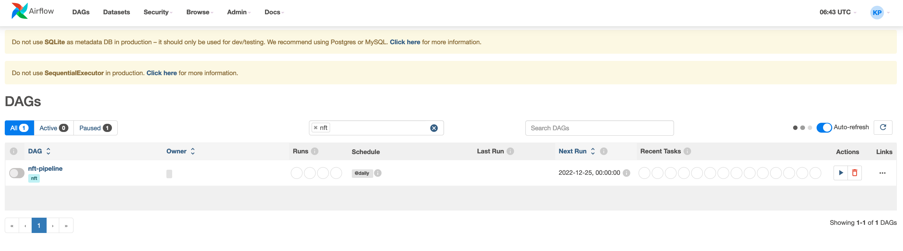
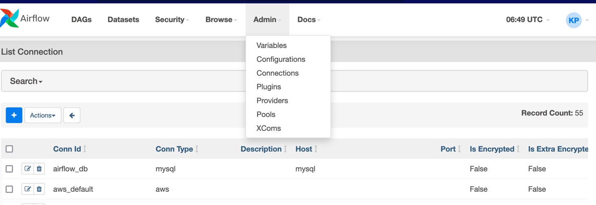
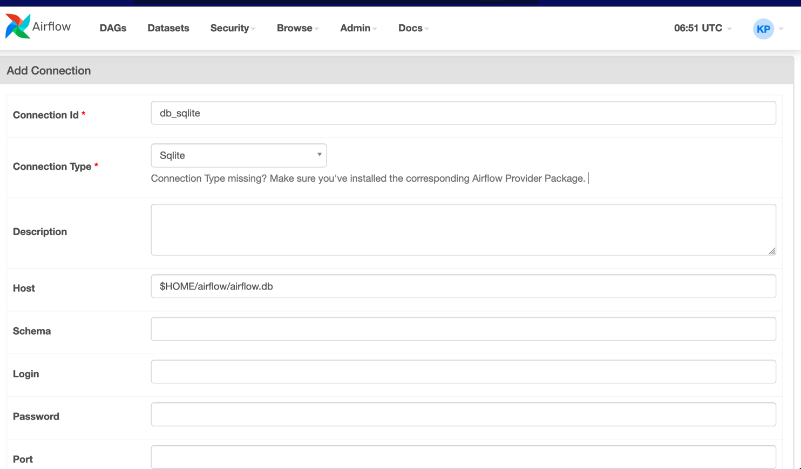
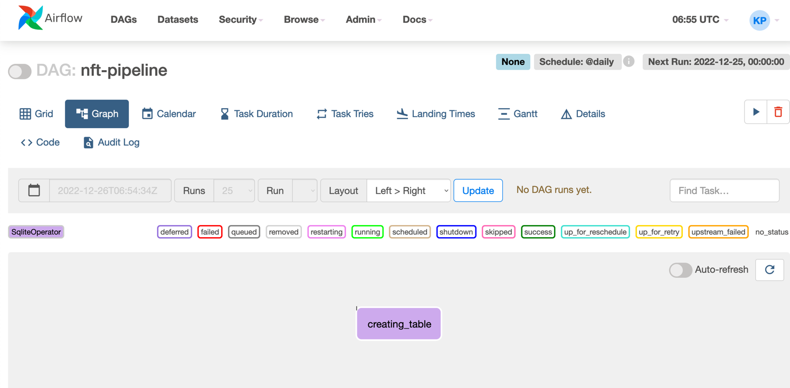
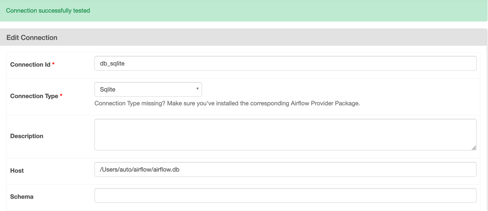
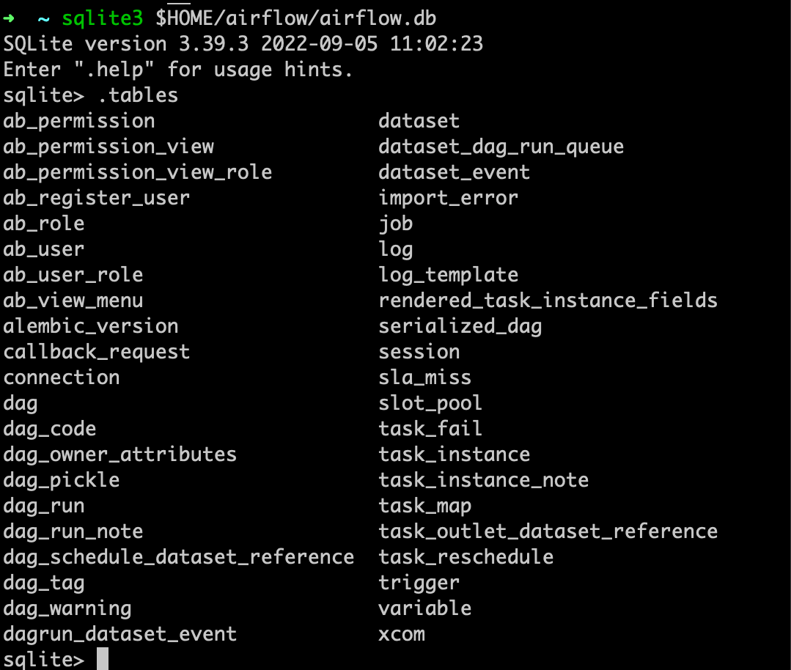
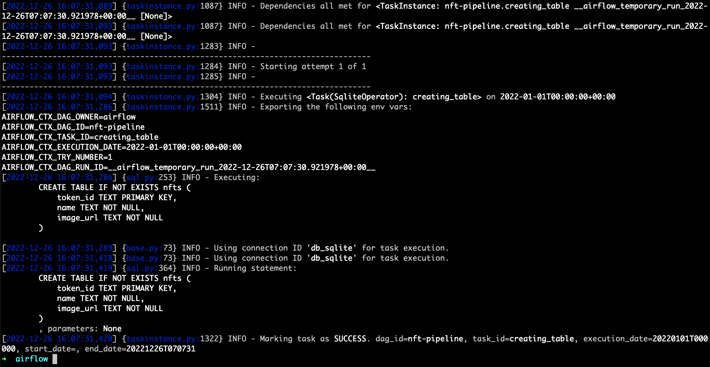
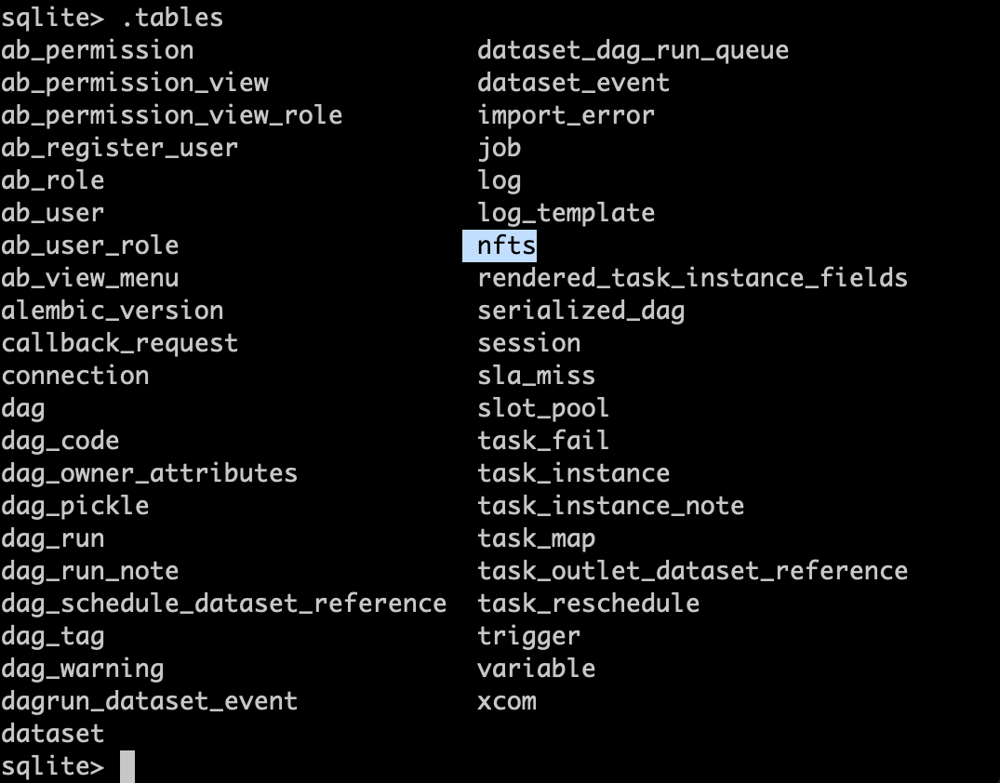
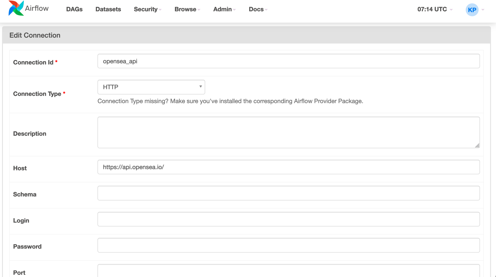
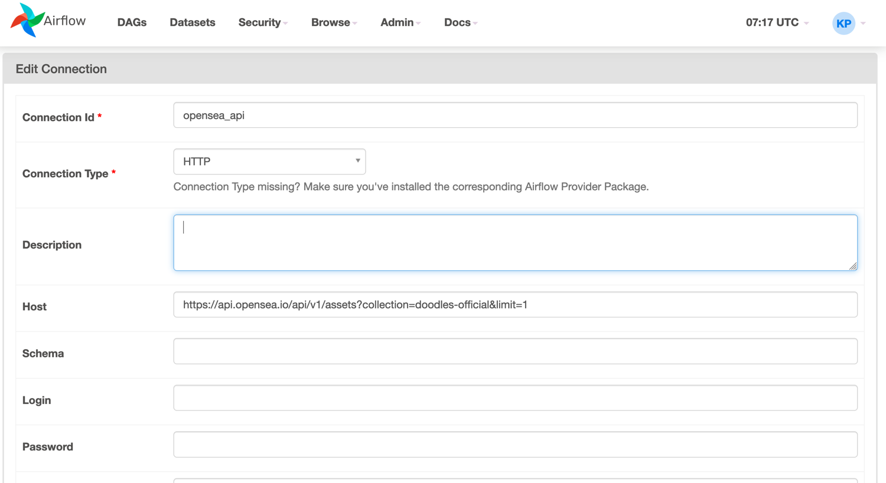

# 2-1 NFT Pipeline project

## Airflow 익히기 위한 예제

### DAG
```text
A -> B ----> 
  -> C ---->   --> 
  ---------> D --> 
  --------------->  C
```

- 위와 같은 `DAG`를 생성할 것.


## project
OpenSea 사이트의 NFT 추출 후 데이터를 테이블에 저장하기

### NFT

인터넷 상에서 소유권을 주장할 수 있는 블록체인 product

`OpenSea`는 소유권을 매매할 수 있는 사이트 (ebay 같은)

테이블 생성 -> Api 확인 -> NFT 정보 추출 -> NFT 정보 가공 -> NFT 정보 저장

1. sqllite
2. sensor
   - api가 존재하는지 확인
3. http simple operation
   - NFT 정보 추출
4. python operator
   - NFT 정보 가공
5. python 
   - NFT 정보 저장


### OpenSea

[open sea site](https://opensea.io/)

`airflow webserver -p 8080`

`airflow scheduler`


## DAG folder 만들기

`mkdir ~/airflow/dags`

`pycharm ~/airflow/dags`

# 2-2. DAG Skeleton

### 뼈대 생성

```python
from datetime import datetime
from airflow import DAG

# 가장 중요한 기본 설정
# start_date : dag를 시작하는 기준 설정
default_args = {
    'start_date': datetime(2021, 1, 1),

}

with DAG(
        dag_id='nft-pipeline',  # ui 에서 보일 ID 지정
        schedule_interval='@daily',
        default_args=default_args,
        tags=['nft'],  # 나중에 찾기 쉽게
        catchup=False
) as dag:
    pass
```

- `~/airflow/dags` 하위에 DAG python 파일을 생성하면 ui에서 확인할 수 있다.
  - 반영하는 데 30초 이상 걸림




# 2-3. Operators

Airflow 내장 operator
- BashOperator
- PythonOperator
- EmailOperator


외부 Operator
- Action Operator
  - 액션을 실행할 때 사용
- Transfer Operator
  - 데이터를 옮길 때 사용
- Sensors
  - 조건이 맞을 때까지 기다릴 때 사용.

Providers packages
- 참 많음.
- 하는 일은 세 가지라고 생각하면 된다.
- amazone
- ...

# 2-4. create Table



- sqlite 가 확인되지 않으면 `pip install sqlite`

- host: sqlite 파일이 존재하는 위치 지정
  - `$HOME/airflow/airflow.db`


```python
from datetime import datetime
from airflow import DAG
from airflow.providers.sqlite.operators.sqlite import SqliteOperator

# 가장 중요한 기본 설정
# start_date : dag를 시작하는 기준 설정
default_args = {
    'start_date': datetime(2021, 1, 1),
}

with DAG(
        dag_id='nft-pipeline',  # ui 에서 보일 ID 지정
        schedule_interval='@daily',
        default_args=default_args,
        tags=['nft'],  # 나중에 찾기 쉽게
        catchup=False
) as dag:
    creating_table = SqliteOperator(
        task_id='creating_table',  # ui에서 확인 가능한 이름
        sqlite_conn_id='db_sqlite',  # UI에서 만들 수 있는 connection 정보
        sql="""
        CREATE TABLE IF NOT EXISTS nfts (
            token_id TEXT PRIMARY KEY,
            name TEXT NOT NULL,
            image_url TEXT NOT NULL
        )
        """

    )
```
- 파일 작성 시 ui에서 확인 가능.
- DAGs -> nft-pipeline > Graph >>> `creating_table`






## airflow tasks test
### db 존재 여부 확인
`sqlite3 $HOME/airflow/airflow.db`
`.table`


## Connection 생성




### task 
`airflow tasks test nft-pipeline creating_table 2022-01-01`
- starting date까지 정의 후 실행






# 2-5. Sensor로 API 확인
외부 API가 존재하는지 확인

## http sensor

```python
from datetime import datetime
from airflow import DAG
from airflow.providers.sqlite.operators.sqlite import SqliteOperator
from airflow.providers.http.sensors.http import HttpSensor

# ...

# Sensor 역시 새로운 Task
with DAG() as dag:
    # ... 기존 코드
    # DAG에 포함된 task
    is_api_available = HttpSensor(
        task_id='is_api_available',
        http_conn_id='opensea_api',  # UI에서 connection 만들어야 함
        endpoint='api/v1/assets?collection=doodles-official&limit=1',
        headers={
            'User-Agent': 'Mozilla/5.0 (Macintosh; Intel Mac OS X 10_11_5) AppleWebKit/537.36 (KHTML, like Gecko) Chrome/50.0.2661.102 Safari/537.36',
            'referrer': url, "X-Api-Key": config["OPENSEA_API_KEY"]}
    )

```

## connection 생성


- root api/ call은 실패



- 이후 path까지 추가함.


### opensea 테스트

`airflow tasks test nft-pipeline is_api_available 2022-01-01`


# 2-6. HttpOperator로 데이터 불러오기

# 2-7. Python Operator로 데이터 처리하기

# 2-8. Hash Operator로 데이터 저장하기

# 2-9. Task 의존성 만들기

# 2-10. Backfill


