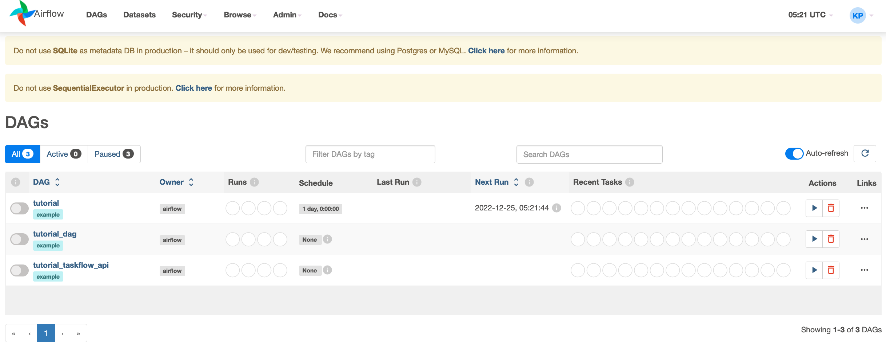
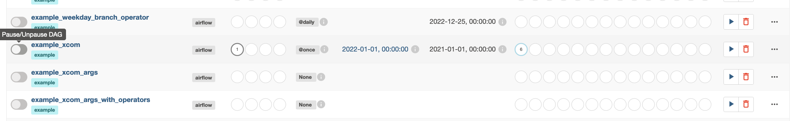
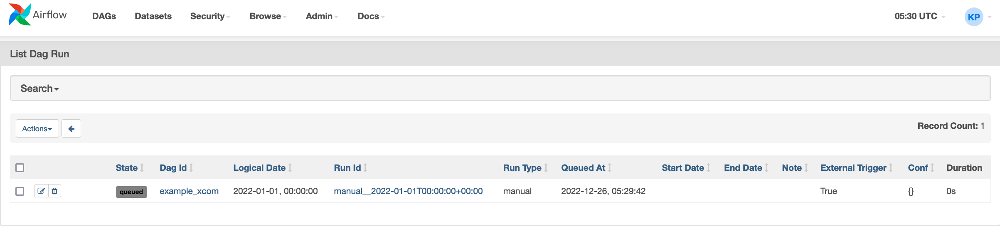
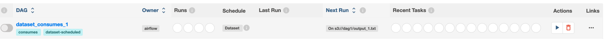
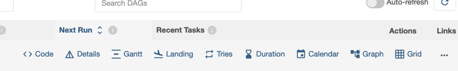
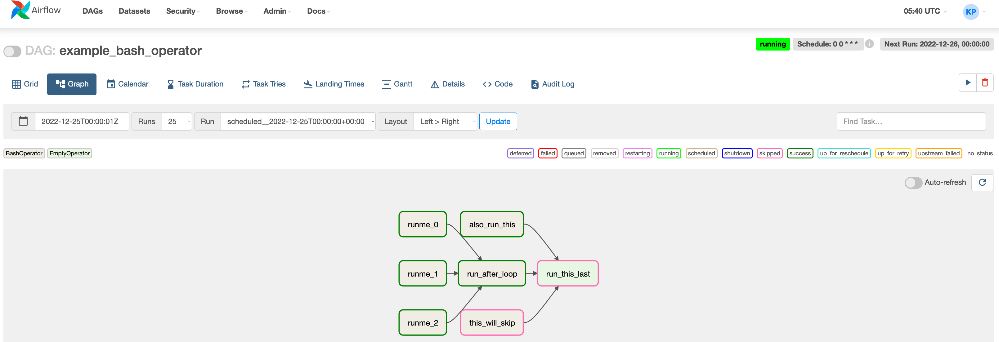
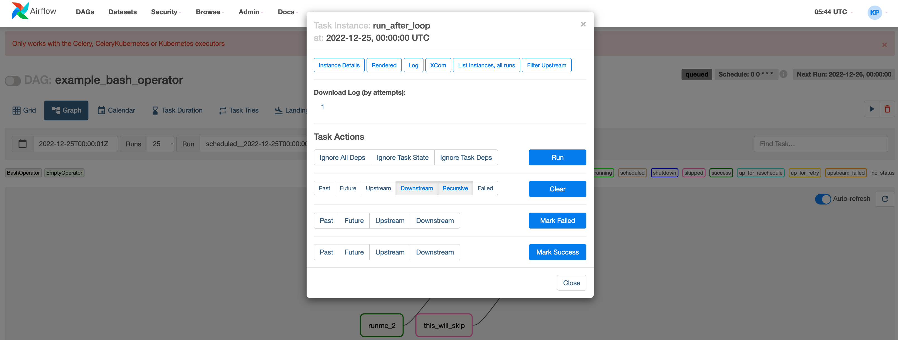
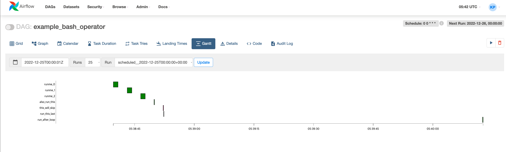

# 1-1. Airflow for workflow

workflow schedule and monitoring platform

## cron 방식의 문제점

- 실패 복구 - 언제 어떻게 다시 실행할 것인가? backfill?
- 모니터링 - 잘 돌아가고 있는지 확인하기 어렵다.
- 의존성 관리 - 데이터 파이프라인 간의 의존성이 있는 경우 상위 데이터 파이프라인이 잘 돌아가고 있는지 파악하기 힘들다
- 확장성 - 중앙화해서 관리하는 툴이 없기 때문에 분산된 환경에서 파이프라인들을 관리하기 힘들다.
- 배포 - 새로운 워크플로우를 배포하기 힘들다.

ex)

        매일 10시에 주기적으로 돌아가는 파이프라인을 만들려면?

download (외부 API) -> process (spark Job) -> store (db)

- 위와 같은 job 파이프라인이 수백 개인 경우 관리하기 어렵다.

이런 배경에서 나온 프로젝트가 `Airflow`이다.

## `Airflow`

workflow를 작성하고 스케줄링과 모니터링 작업을 프로그래밍 할 수 있도록 제공하는 플랫폼

- 파이썬으로 쉬운 프로그래밍이 가능
- 분산된 환경에서 확장성이 있음
- 웹 대시보드 (UI)
- 커스터마이징이 가능

### `workflow`

- 의존성으로 연결된 작업 (`TASK`) 들의 집합이다.
    - DAG

### `airflow가 제공하는 기능`

- 웹 서버
    - web dashboard UI
- scheduler
    - 워크플로우가 언제 실행되는지 관리
- Metastore
    - 메타데이터 관리
- Executor
    - 태스크가 어떻게 실행되는지 정의
- Worker
    - 태스크를 실행하는 프로세스

### DAG (Directed Acyclic Graph)

- 비순환 그래프

### 유용성

주기적으로 관리할 작업에 유용하다.

- 데이터 웨어하우스
- 머신러닝
    - 학습 시 workflow
- 분석
- 실험
- 데이터 인프라 관리

# 1-2. Airflow 구조

## one node architecture

- web server
- scheduler
- metastore
- executor
    - queue에 task 순서를 정할 수 있다.

## multi node architecture

- web server
- scheduler
- metastore
- executor
    - Celery Broker (Queue)
        - 노드 바깥에 존재하여 여러 worker 노드들의 task를 관리한다.

## 동작 방식

1. DAG를 작성하여 workflow 만듦. (DAG는 Task로 구성되어 있다.)
2. `Task`는 `Operator가 인스턴스화` 된 것.
3. DAG를 실행시킬 때 `Scheduler`는 `DagRun Object`를 만든다.
4. `DagRun Object`는 `Task Instance`를 만든다.
5. `Worker`가 `Task`를 수행 후 `DagRun`의 상태를 `완료`로 바꾼다.

# 1-3. Airflow 설치

airflow 내 pip에서 실행

`pip --version`

`pip install apache-airflow`

airflow directory 생성
`ls ~/airflow`

## 실행

### init
`airflow db init`

### enable webserver
`airflow webserver -p 8080`

### create user

`airflow users create --role Admin --username ps --email ps --firstname ps --lastname ps --password ps`

# 1-4. Airflow Cli

## Command line

`airflow -h`

## group command
- dags
- db
- users

## single command
- cheat-sheet
- scheduler
- webserver


## 실습

1. `airflow webserver -p 8080`
2. `airflow users create --role Admin --username ps --email ps --firstname ps --lastname ps --password ps`
3. `airflow users list`
4. `airflow users create --role Admin --username psxyz --email qwer3@kakao.com --firstname k --lastname ps --password admin090`
   1. `> [2022-12-26 14:19:17,134] {manager.py:212} INFO - Added user psxyz User "psxyz" created with role "Admin"`
5. `airflow users list`


## create scheduler

```text
The scheduler does not appear to be running.
The DAGs list may not update, and new tasks will not be scheduled.
```

`airflow scheduler`



## `airflow db -h`


## `airflow dags -h`

- `backfill`
  - 무언가 망가졌을 때 고친 후 되돌리는 작업
- `delete`
  - dag 삭제
- `list jobs`
  - 등록된 잡
- `list runs`
  - 돌아가는 dag

`airflow dags list`


`airflow tasks list example_xcom`

### example_xcom 트리거하고 싶을 때

DAG를 실행시키는 트리거를 실행시키겠다

`airflow dags trigger -h`

`airflow dags trigger -e 2022-01-01 example_xcom`





# 1-5. Airflow UI



## 사용법

### Owner
dag를 누가 만들었는지

### Runs
Dag의 상태를 나타내고 있음.

### Schedule
주기적 스케줄의 정보
- 매일 @daily
- 1회성은 none

### Last Run
마지막 실행 시간

### Next Run
다음 실행 시간

### Recent Tasks

### Actions 
지금 실행 또는 인스턴스 삭제

### Links

- Code
- Details
- Gantt
- Landing
- Tries
- Duration
- Calendar
- ...

### Graph UI




- Run
  - 실행
- Clear
  - 저장된 데이터 삭제
- Mark Failed
  - 강제로 실패
- mark Success
  - 강제로 성공
  - 이후 `task(run_this_last)`가 동작할 것

### Gantt
각각의 `task`가 소비한 시간을 확인할 수 있다.



