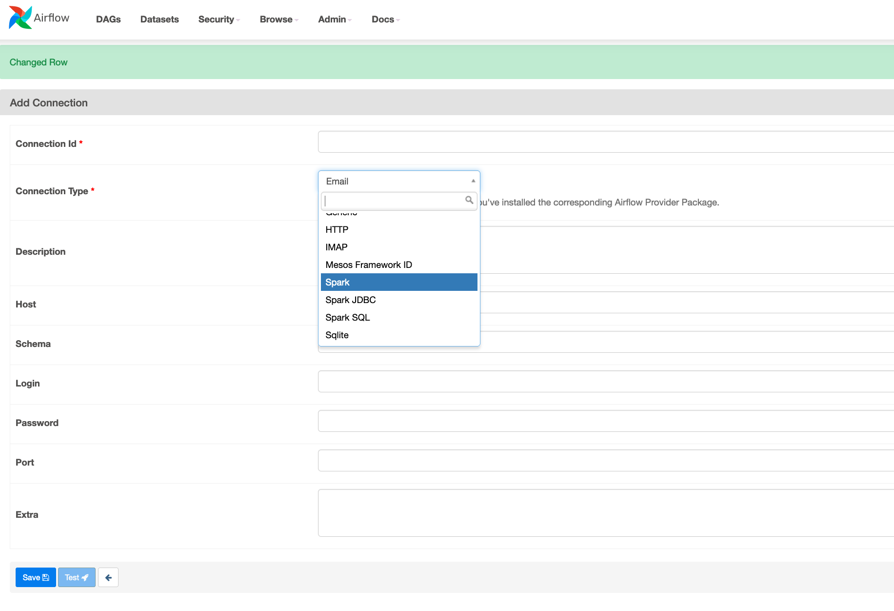
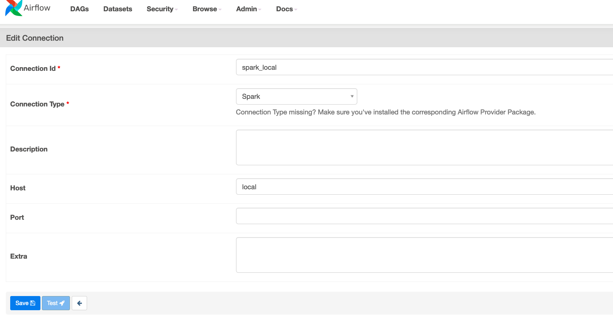
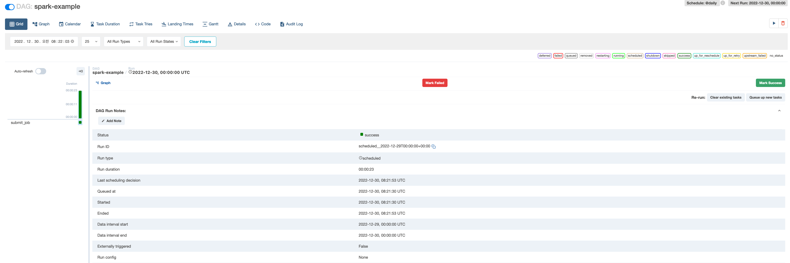
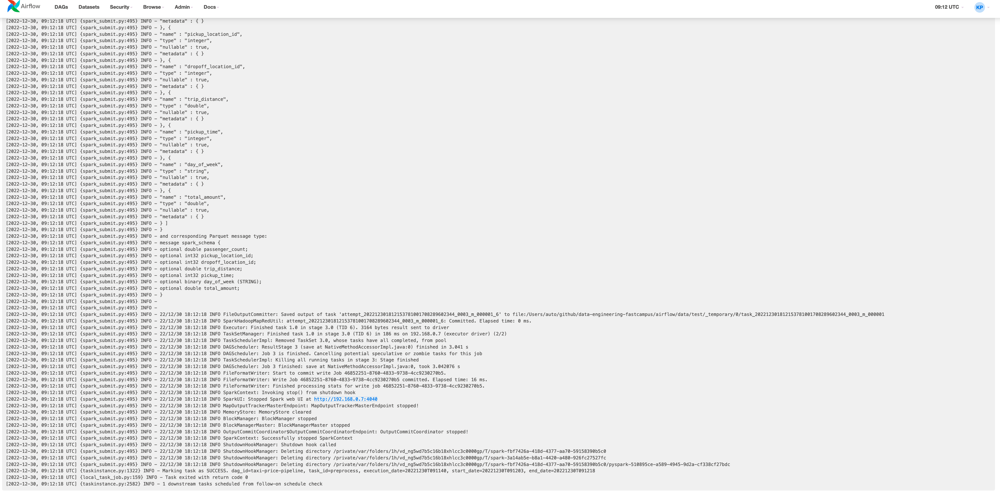
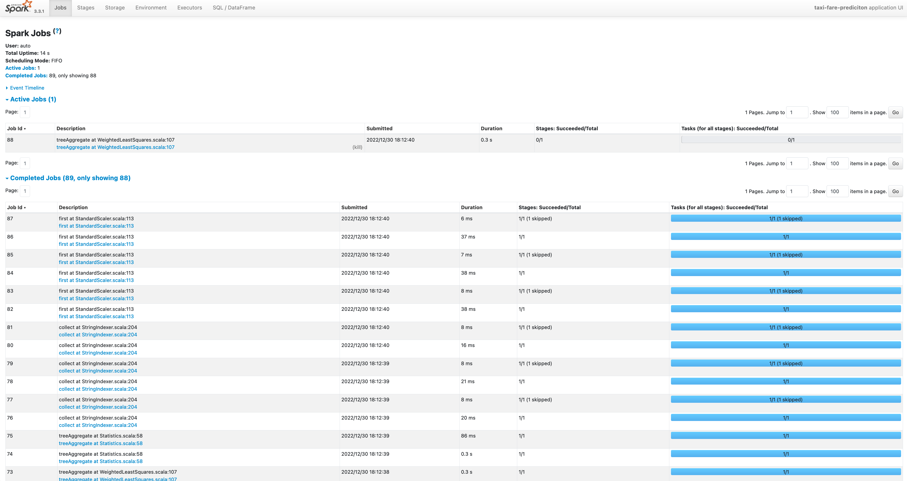

# 3-1. Airflow로 Spark pipeline 만들기

## provider 설치하기

`pip install apache-airflow-providers-apache-spark`

## airflow UI 반영

설치 후 `spark` 확인이 안되는 경우 `airflow` 재시작이 필요합니다.

```bash
Ctrl + C

airflow webserver -p 8080
```




### 설정



## 코드

`vim $HOME/airflow/dags/spark-example.py`

```python
from datetime import datetime

from airflow import DAG
# from airflow.providers.apache.spark.operators.spark_sql import SparkSqlOperator
from airflow.providers.apache.spark.operators.spark_submit import SparkSubmitOperator

default_args = {
    'start_date': datetime(2021, 1, 1),
}

with DAG(dag_id='spark-example',
         schedule_interval='@daily',
         default_args=default_args,
         tags=['spark'],
         catchup=False) as dag:
    # sql_job = SparkSqlOperator(sql="SELECT * FROM foobar", master='local', task_id='sql_job')  # 지양
    submit_job = SparkSubmitOperator(
        application='/Users/auto/github/data-engineering-fastcampus/src/main/scala/_02/count_trips_sql.py',
        task_id='submit_job',
        conn_id='spark_local'
    )

```

## 결과




# 3-2. taxi data

1. taxi 데이터 입력
2. preprocessing
3. model 학습

## 파일의 역할

- [preprocess.py](../../../src/main/scala/_02/preprocess.py)
  - taxi 데이터 읽고, trips spark sql로 불필요한 데이터 제거
- [tune_hyperparameter.py](../../../src/main/scala/_02/tune_hyperparameter.py)
  - 현 시점 최적의 파라미터 찾고, 최적의 파라미터를 csv 파일로 저장
- [train_model.py](../../../src/main/scala/_02/train_model.py)
  - `preprocess.py`, `tune_hyperparameter.py` 작업을 거친 데이터로 모델 학습 후 `weights` 저장


## 실행 결과 - 성공

### airflow UI


### spark UI



