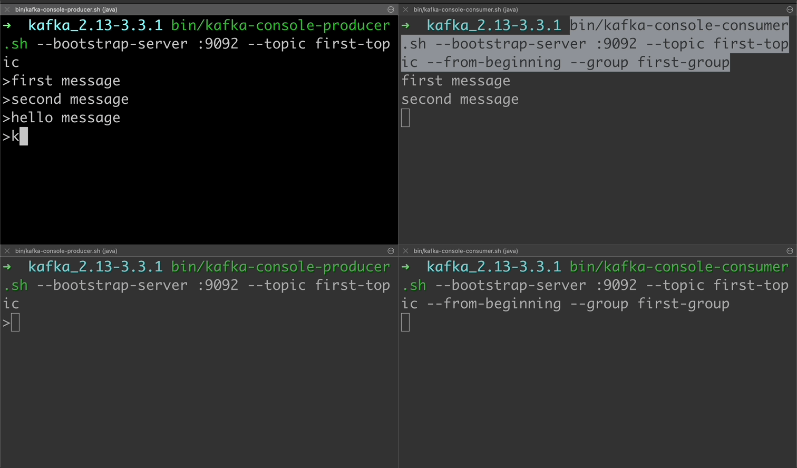
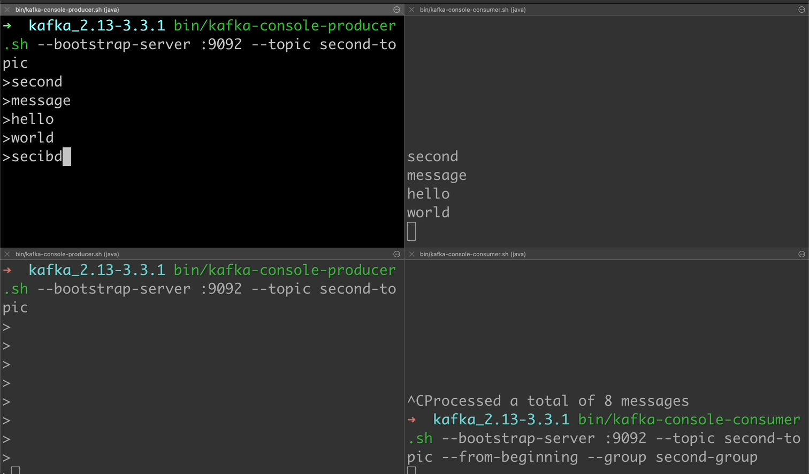

# 2-1. Zookeeper 콘솔에서 시작하기

```bash
./bin/zookeeper-server-start.sh -daemon ./config/zookeeper.properties

netstat -an | grep 2181
```


# 2-2. Broker 시작하기

```bash
./bin/kafka-server-start.sh -daemon ./config/kafka-server.properties

netstat -an | grep 9092
```

# 2-3. Topic 만들기

```bash
bin/kafka-topics.sh --bootstrap-server :9092 --create --topic first-topic --partitions 1 --replication-factor 1
# Created topic first-topic.

bin/kafka-topics.sh --bootstrap-server :9092 --list
# first-topic

bin/kafka-topics.sh --bootstrap-server :9092 --describe
# Topic: first-topic	TopicId: _Bg_QISLRJi9RKo21imZ1A	PartitionCount: 1	ReplicationFactor: 1	Configs:
#	Topic: first-topic	Partition: 0	Leader: 0	Replicas: 0	Isr: 0
```

### 삭제 (진행하지 않음)

```bash
# bin/kafka-topics.sh --bootstrap-server :9092 --delete --topic first-topic
```

# 2-4. Producer CLI
```bash
bin/kafka-console-producer.sh --bootstrap-server :9092 --topic first-topic
> kafka is fun
> spark is fun too
```


# 2-5. Consumer CLI

```bash
bin/kafka-console-consumer.sh --bootstrap-server :9092 --topic first-topic --from-beginning
```

# 2-6. Consumer Group CLI

unique한 consumer group이 자동으로 생성

```bash
kafka_2.13-3.3.1 bin/kafka-consumer-groups.sh --bootstrap-server :9092 --list
# console-consumer-91937

# kafka consumer group 지정
bin/kafka-console-consumer.sh --bootstrap-server :9092 --topic first-topic --from-beginning --group first-group

# kafka consumer group 확인
bin/kafka-consumer-groups.sh --bootstrap-server :9092 --list
# console-consumer-91937
# console-consumer-54468
# first-group
```

# 2-7. Consumer와 Partitions

```bash
bin/kafka-topics.sh --bootstrap-server :9092 --topic second-topic --partitions 2 --replication-factor 1 --create
# Created topic second-topic

bin/kafka-topics.sh --bootstrap-server :9092 --describe --topic second-topic
# Topic: second-topic	TopicId: y8_PjjDvQs-eH8yPXfvRzw	PartitionCount: 2	ReplicationFactor: 1	Configs: 
#	Topic: second-topic	Partition: 0	Leader: 0	Replicas: 0	Isr: 0
#	Topic: second-topic	Partition: 1	Leader: 0	Replicas: 0	Isr: 0

```

## partition 1개, consumer group 1개, consumer 2개

### first-topic

하나의 consumer는 메시지를 수신하지 않는다.




## partitions 2개, consumer group 1개, consumer 2개

### second-topic

1:1 매핑으로 수신한다.

