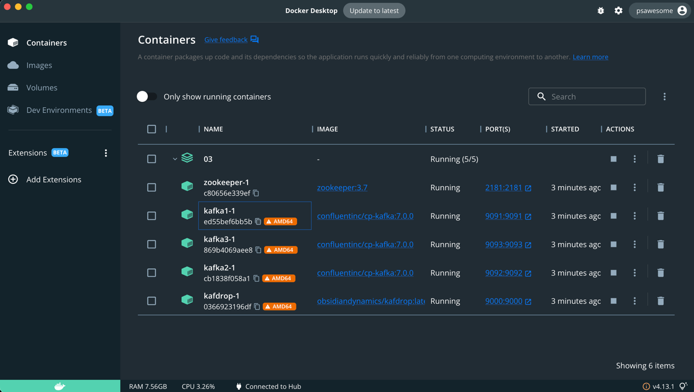
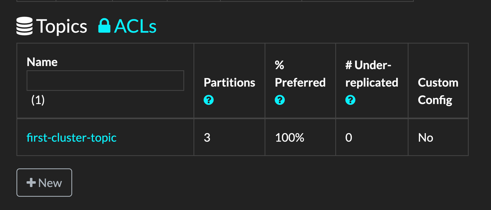
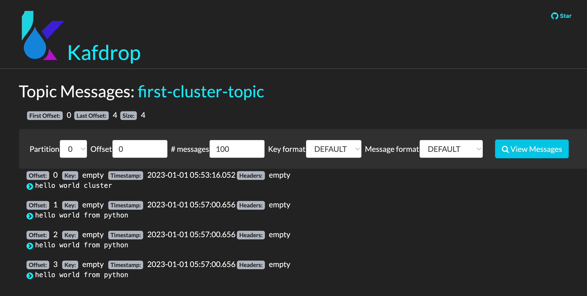

# 3-1. 파이썬과 카프카 기초

## install

```bash
pip install kafka-python
```

# 3-2. 파이썬으로 producer 만들기

```python
from kafka import KafkaProducer

producer = KafkaProducer(bootstrap_servers=['localhost:9092'])

producer.send('first-topic', b'hello world from python')
producer.flush()
```

# 3-3. 파이썬으로 Consumer 만들기
```python
from kafka import KafkaConsumer

consumer = KafkaConsumer('first-topic', bootstrap_servers=['localhost:9092'])

for msg in consumer:
    print(msg)
```

# 3-4. 도커 설치

https://www.docker.com/products/docker-desktop/


# 3-5. kafka cluster 구축 준비

zookeeper 3개

replication factor 2

기존 서버 중단시키기

```bash
bin/kafka-server-stop.sh
bin/zookeeper-server-stop.sh
```


# 3-6. kafka cluster 구축하기 - zookeeper

```yaml
version: '3'
services:
  zookeeper:
    image: zookeeper:3.7
    hostname: zookeeper
    ports:
      - "2181:2181"
    environment:
      ZOO_MY_ID: 1
      ZOO_PORT: 2181
      ZOO_SERVERS: server.1=zookeeper:2888:3888  # check
    volumes:
      - ./data/zookeeper/data:/data
      - ./data/zookeeper/datalog:/datalog
```

# 3-7. kafka cluster 구축하기 - kafka-brokers

```yaml
version: '3'
services:
  kafka1:
    image: confluentinc/cp-kafka:7.0.0
    hostname: kafka1
    ports:
      - "9091:9091"
    environment:
      KAFKA_ADVERTISED_LISTENERS: LISTENER_DOCKER_INTERNAL://kafka1:19091,LISTENER_DOCKER_EXTERNAL://${DOCKER_HOST_IP:-127.0.0.1}:9091
      KAFKA_LISTENER_SECURITY_PROTOCOL_MAP: LISTENER_DOCKER_INTERNAL:PLAINTEXT,LISTENER_DOCKER_EXTERNAL:PLAINTEXT
      KAFKA_INTER_BROKER_LISTENER_NAME: LISTENER_DOCKER_INTERNAL
      KAFKA_ZOOKEEPER_CONNECT: "zookeeper:2181"
      KAFKA_BROKER_ID: 1
      KAFKA_OFFSETS_TOPIC_REPLICATION_FACTOR: 1
    volumes:
      - ./data/kafka1/data:/tmp/kafka-logs
    depends_on:
      - zookeeper
  kafka2:
    image: confluentinc/cp-kafka:7.0.0
    hostname: kafka2
    ports:
      - "9092:9092"
    environment:
      KAFKA_ADVERTISED_LISTENERS: LISTENER_DOCKER_INTERNAL://kafka2:19092,LISTENER_DOCKER_EXTERNAL://${DOCKER_HOST_IP:-127.0.0.1}:9092
      KAFKA_LISTENER_SECURITY_PROTOCOL_MAP: LISTENER_DOCKER_INTERNAL:PLAINTEXT,LISTENER_DOCKER_EXTERNAL:PLAINTEXT
      KAFKA_INTER_BROKER_LISTENER_NAME: LISTENER_DOCKER_INTERNAL
      KAFKA_ZOOKEEPER_CONNECT: "zookeeper:2181"
      KAFKA_BROKER_ID: 2
      KAFKA_OFFSETS_TOPIC_REPLICATION_FACTOR: 1
    volumes:
      - ./data/kafka2/data:/tmp/kafka-logs
    depends_on:
      - zookeeper
  kafka3:
    image: confluentinc/cp-kafka:7.0.0
    hostname: kafka3
    ports:
      - "9093:9093"
    environment:
      KAFKA_ADVERTISED_LISTENERS: LISTENER_DOCKER_INTERNAL://kafka3:19093,LISTENER_DOCKER_EXTERNAL://${DOCKER_HOST_IP:-127.0.0.1}:9093
      KAFKA_LISTENER_SECURITY_PROTOCOL_MAP: LISTENER_DOCKER_INTERNAL:PLAINTEXT,LISTENER_DOCKER_EXTERNAL:PLAINTEXT
      KAFKA_INTER_BROKER_LISTENER_NAME: LISTENER_DOCKER_INTERNAL
      KAFKA_ZOOKEEPER_CONNECT: "zookeeper:2181"
      KAFKA_BROKER_ID: 3
      KAFKA_OFFSETS_TOPIC_REPLICATION_FACTOR: 1
    volumes:
      - ./data/kafka3/data:/tmp/kafka-logs
    depends_on:
      - zookeeper
```
  
# 3-8. kafka cluster 구축하기 - kafdrop

## kafka cluster managing

```yaml
version: '3',
services:
  kafdrop:
    image: obsidiandynamics/kafdrop
    restart: "no"
    ports: 
      - "9000:9000"
    environment:
      KAFKA_BROKER_CONNECT: "kafka1:19091"
    depends_on:
      - kafka1
      - kafka2
      - kafka3
```


# 3-9. kafka cluster 구축하기 - topic 생성

```bash
docker-compose rm -svf
docker-compose up -d
```


```bash
docker exec -it ed55bef6bb5b108ca78a0efd71450d063a02643cbef8edf77f709bea7c6fef1f kafka-topics --bootstrap-serv
er=localhost:19091 --create --topic first-cluster-topic --partitio
ns 3 --replication-factor 1
Created topic first-cluster-topic.
```

## 토픽 생성이 더 쉬운 kafdrop


- new 버튼을 통해 생성 가능

# 3-10. kafka cluster 이용하는 Producer
```python
from kafka import KafkaProducer

brokers = [':9091', ":9092", ":9093"]
topic_name = 'first-cluster-topic'

producer = KafkaProducer(bootstrap_servers=brokers)

producer.send(topic_name, b'hello world cluster')
producer.flush()
```

# 3-11. kafka cluster 이용하는 Consumer
```python
from kafka import KafkaConsumer

brokers = [":9091", ":9092", ":9093"]
consumer = KafkaConsumer('first-cluster-topic', bootstrap_servers=brokers)

for msg in consumer:
    print(msg)
```

# 3-12. kafdrop 메시지 확인하기

- view message

# 3-13. csv를 스트림으로 바꿔주는 Producer, Consumer

## Producer 
```python
import csv
import json
import time

from kafka import KafkaProducer

brokers = [':9091', ':9092', ':9093']
producer = KafkaProducer(bootstrap_servers=brokers)

topic_name = 'trips'

with open('/Users/auto/github/data-engineering-fastcampus/data/trips/yellow_tripdata_2021-01.csv', 'r') as file:
    reader = csv.reader(file)
    header = next(reader)

    for row in reader:
        producer.send(topic_name, json.dumps(row).encode('utf-8'))
        print(row)
        time.sleep(1)
```

## Consumer
```python
if __name__ == '__main__':
    from kafka import KafkaConsumer
    import json

    brokers = [':9091', ':9092', ':9093']
    topic_name = 'trips'

    consumer = KafkaConsumer(topic_name, bootstrap_servers=brokers)

    for msg in consumer:
        # json.loads() == string to python
        row = json.loads(msg.value.decode())
        # ,VendorID,tpep_pickup_datetime,tpep_dropoff_datetime,passenger_count,trip_distance,RatecodeID,store_and_fwd_flag,PULocationID,DOLocationID,payment_type,fare_amount,extra,mta_tax,tip_amount,tolls_amount,improvement_surcharge,total_amount,congestion_surcharge,airport_fee
        # 10 == payment_type
        # 11 == fare_amount
        if float(row[11]) > 10:
            print('--over 10--')
            print(f'{row[10]} - {row[11]}')

```


# 3-14. 비정상 데이터 탐지 - Producer

```python
TOPIC_NAME = 'payments'
if __name__ == '__main__':
    import datetime
    import random
    import json
    import time

    import pytz

    from kafka import KafkaProducer

    brokers = [':9091', ':9092', ':9093']
    producer = KafkaProducer(bootstrap_servers=brokers)


    def get_time_date():
        utc_now = pytz.utc.localize(datetime.datetime.utcnow())
        kst_now = utc_now.astimezone(pytz.timezone('Asia/Seoul'))
        _d = kst_now.strftime('%m/%d/%Y')
        _t = kst_now.strftime("%H:%M:%S")
        return _d, _t


    def generate_payment_data():
        _payment_type = random.choice(['VISA', 'MASTERCARD', 'BITCOIN'])
        _amount = random.randint(0, 100)
        _to = random.choice(['me', 'mom', 'dad', 'friend', 'stranger'])
        return _payment_type, _amount, _to


    while True:
        d, t, = get_time_date()
        payment_type, amount, to = generate_payment_data()
        new_data = {
            'DATE': d,
            'TIME': t,
            'PAYMENT_TYPE': payment_type,
            'AMOUNT': amount,
            'TO': to,
        }

        producer.send(TOPIC_NAME, json.dumps(new_data).encode('utf-8'))
        print(new_data)
        time.sleep(1)
```


# 3-15. 비정상 데이터 탐지 - Detector

수신된 데이터가 정상인지 비정상인지 분류하는 detector

`PAYMENT_TYPE`이 `BITCOIN`인 경우 수상하다고 체크

```python
PAYMENT_NAME = 'payments'

FRAUD_TOPIC = 'fraud_payments'
LEGIT_TOPIC = 'legit_payments'
if __name__ == '__main__':
    from kafka import KafkaConsumer, KafkaProducer

    import json

    brokers = [':9091', ':9092', ':9093']
    consumer = KafkaConsumer(PAYMENT_NAME, bootstrap_servers=brokers)

    producer = KafkaProducer()


    def is_suspicious(transactions) -> bool:
        # 수상한지 체크
        return transactions['PAYMENT_TYPE'] == 'BITCOIN'


    for msg in consumer:
        # {'DATE': '01/01/2023', 'TIME': '16:18:20', 'PAYMENT_TYPE': 'VISA', 'AMOUNT': 17, 'TO': 'friend'}
        msg = json.loads(msg.value.decode())
        topic = FRAUD_TOPIC if is_suspicious(msg) else LEGIT_TOPIC

        producer.send(topic, json.dumps(msg).encode('utf-8'))
        print(topic, is_suspicious(msg), msg['PAYMENT_TYPE'])

```

# 3-16. 비정상 데이터 탐지 - Processor

비정상으로 탐지하는 `BITCOIN` 거래가 특정 금액 이상인 경우 사용자에게 연락을 주는 역할


## fraud_detector.py

```python
if __name__ == '__main__':
    from kafka import KafkaConsumer

    import json
    from _03.fraud_detection.fraud_detector import FRAUD_TOPIC

    brokers = [':9091', ':9092', ':9093']
    consumer = KafkaConsumer(FRAUD_TOPIC, bootstrap_servers=brokers)

    for msg in consumer:
        m = json.loads(msg.value.decode())
        to = m['TO']
        amount = m["AMOUNT"]
        if to == 'stranger':
            print(f'[ALERT] fraud detect payment to : {to} - {amount}')
        else:
            print(f'[PROCESSING BITCOIN] payment to :{to} - {amount}')

```

## legit_processor.py

```python
from _03.fraud_detection.fraud_detector import LEGIT_TOPIC
if __name__ == '__main__':
    from kafka import KafkaConsumer

    import json

    broker = [':9091', ':9092', ':9093']
    consumer = KafkaConsumer(LEGIT_TOPIC, bootstrap_servers=broker)

    for msg in consumer:
        m = json.loads(msg.value.decode())
        to = m['TO']
        amount = m["AMOUNT"]

        # payment_type에 따라 처리가 달라짐
        if m['PAYMENT_TYPE'] == 'VISA':
            print(f'[VISA] payment to : {to} - {amount}')
        elif m['PAYMENT_TYPE'] == 'MASTERCARD':
            print(f'[MASTERCARD] payment to :{to} - {amount}')
        else:
            print('[ALERT] unable to process payments')

```
